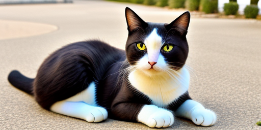

# Run stable-diffusion.cpp on the Jetson Nano Developer Kit 4GB

## Purpose

**Generate images from a text prompt with just one command!**

Example:  _"a relaxed nice cat, full SD photo"_
<p align="left"></p>


## About sd.cpp

If you never heard about sd.cpp, read first the leejet's [current README](https://github.com/leejet/stable-diffusion.cpp/blob/master/README.md) file.
also please read about the [commit](https://github.com/leejet/stable-diffusion.cpp/blob/e1384de/README.md) this repository is built on.


## About this special fork for the Jetson Nano

Later sd.cpp (https://github.com/leejet/stable-diffusion.cpp) commits require a more up-to-date NVCC compiler, CUDA Toolkit 11+, and improved GPU capabilities, which the Jetson's NVIDIA Tegra X1 lacks. The highest CUDA version supported on the Jetson Nano is 10.2. This fork is based on leejet's commit #e1384de (https://github.com/leejet/stable-diffusion.cpp/tree/e1384de), the last in a long series of usable commits. That's why this project was started. It can be easily compiled using the ```CUDA``` option out of the box on the Jetson Nano, no patches are needed. Many thanks for this excellent work! For detailed compilation instructions, see below.

**Many commits from the newer sd.cpp versions have been backported to this particular fork.**  Most of these commits concern the operation of SD1/2.x models and some tiny derivatives. Due to the limited shared memory in the Jetson Nano, the inpainting function and the features of more advanced models (SD3, Flux, Z-Image, etc.) could not be ported. However, this fork provides everything you need to get started with sd.cpp on the Jetson Nano. Some differences between the sd.cpp versions are:
|                 |   leejet master  |  leejet #e1384de |   Jetson Nano    |
| --------------- |:----------------:|:----------------:|:----------------:|
| Basic features  |:white_check_mark:|:white_check_mark:|:white_check_mark:|
| LoRAs           |:white_check_mark:|:white_check_mark:|:white_check_mark:|
| Embeddings      |:white_check_mark:|:white_check_mark:|:white_check_mark:|
| Convert mode    |:white_check_mark:|:white_check_mark:|:white_check_mark:|
| Photo maker     |:white_check_mark:|:white_check_mark:|:red_circle:      |
| Control Net     |:white_check_mark:|:white_check_mark:|:red_circle:      |
| IMG2IMG mode    |:white_check_mark:|:white_check_mark:|:red_circle:      |
| advanced models |:white_check_mark:|:red_circle:      |:red_circle:      |
| Video support   |:white_check_mark:|:red_circle:      |:red_circle:      |
| more samplers   |:white_check_mark:|:red_circle:      |:white_check_mark:|
| more schedulers |:white_check_mark:|:red_circle:      |:white_check_mark:|
| JPG support     |:white_check_mark:|:red_circle:      |:white_check_mark:|
| MMAP support    |:white_check_mark:|:red_circle:      |:white_check_mark:|
| CPU rng         |:white_check_mark:|:red_circle:      |:white_check_mark:|
|tiny U-Net models|:white_check_mark:[^1]|:red_circle:  |:white_check_mark:|

[^1]: tiny U-Net models except SDXS-09, and except "small" and "medium" versions of SD1.X and SD 2.x, see [models section](##Models) .


## Compiling on the Jetson Nano

### Prerequisites

You will need the following software installed, consider the installation of gcc and cmake might take several hours.

* Ubuntu 20.04 OS
* GCC and CXX (g++) 8.5
* cmake >= 3.2
* Nvidia CUDA Compiler nvcc 10.2

See here for some details on [Jetson Nano environment](./docs/prerequisites_on_JetsonNano.md)

### Build process

Build from scratch as follows:
```
mkdir build
cd build
cmake .. -DSD_CUDA=ON                # old was:  cmake .. -DSD_CUBLAS=ON
cmake --build . --config Release
```


## Running sd.cpp on the Jetson Nano

Of course you will only run *tiny* models on this *tiny* device, see below.
If using f16 tensors do not try to extend the output picture dimensions much more than ```512 x 512```. For resolutions like ```512 x 768``` or models like Segmind's VEGA or SSD1B try weight types like ```q4_0``` (via option ```--type q4_0```).

### Run example:
```
./sd  -m ~/your-sd1.5-model.safetensors -W 384 -H 512 \
  -v --steps 15 --taesd ~/your-taesd-model.safetensors \
  -p "A lovely little kitten, full SD photo"
```  
Here are some output parts:
```
[DEBUG] stable-diffusion.cpp:149  - Using CUDA backend
ggml_init_cublas: GGML_CUDA_FORCE_MMQ:   no
ggml_init_cublas: CUDA_USE_TENSOR_CORES: yes
ggml_init_cublas: found 1 CUDA devices:
  Device 0: NVIDIA Tegra X1, compute capability 5.3, VMM: no
...
[INFO ] stable-diffusion.cpp:419  - total params memory size = 1877.65MB (VRAM 1877.65MB, RAM 0.00MB): clip 235.06MB(VRAM), unet 1640.25MB(VRAM), vae 2.34MB(VRAM), controlnet 0.00MB(VRAM), pmid 0.00MB(VRAM)
....
[DEBUG] ggml_extend.hpp:837  - unet compute buffer size: 325.82 MB(VRAM)
  |==================================================| 15/15 - 14.75s/it
[INFO ] stable-diffusion.cpp:1763 - sampling completed, taking 221.48s
[INFO ] stable-diffusion.cpp:1771 - generating 1 latent images completed, taking 221.60s
[INFO ] stable-diffusion.cpp:1774 - decoding 1 latents
[DEBUG] ggml_extend.hpp:837  - taesd compute buffer size: 360.00 MB(VRAM)
[DEBUG] stable-diffusion.cpp:1455 - computing vae [mode: DECODE] graph completed, taking 5.63s
[INFO ] stable-diffusion.cpp:1784 - latent 1 decoded, taking 5.63s
[INFO ] stable-diffusion.cpp:1788 - decode_first_stage completed, taking 5.63s
[INFO ] stable-diffusion.cpp:1872 - txt2img completed in 227.73s
save result image to 'output.png'
```

## Models

Download model weights and run them:
Beside well known SD1.5 models, e.g.:
* https://huggingface.co/second-state/stable-diffusion-v1-5-GGUF

using some other **tiny models** is recommended, e.g. this models of SD1 and SD2 styles:
* https://huggingface.co/segmind/tiny-sd
* https://huggingface.co/segmind/portrait-finetuned
* https://huggingface.co/nota-ai/bk-sdm-tiny
* https://huggingface.co/nota-ai/bk-sdm-v2-tiny
* https://huggingface.co/IDKiro/sdxs-512-dreamshaper

also using some distilled SDXL models is possible:
* https://huggingface.co/segmind/Segmind-Vega
* https://huggingface.co/stabilityai/sd-turbo

some more models with **small** and **medium** sized U-Nets are implemented *here*, but *not* in leejet's master version:
* https://huggingface.co/nota-ai/bk-sdm-small
* https://huggingface.co/nota-ai/bk-sdm-base
* https://huggingface.co/OFA-Sys/small-stable-diffusion-v0
* https://huggingface.co/nota-ai/bk-sdm-v2-small
* https://huggingface.co/nota-ai/bk-sdm-v2-base
* https://huggingface.co/IDKiro/sdxs-512-0.9

There may be other usable models available online. Naturally, IDKiro's models will be the fastest since they require only one step in U-Net. For example, using sdxs-512-dreamshaper, you can generate a 512x512 PNG image in just 12 seconds! However, each model has its own advantages and limitations. Feel free to explore them all. Keep in mind that since the Jetson Nano has only 4GB of shared RAM (GPU/CPU), running some larger models may not be feasible.
It is recommended to convert these models into the **safetensors** or preferably into **gguf** format. Creating a .safetensors file involves two steps, please see some hints in https://github.com/leejet/stable-diffusion.cpp/blob/master/docs/distilled_sd.md for detailed instructions.
Quantization and creating **gguf** files is very well described here: https://github.com/leejet/stable-diffusion.cpp/blob/master/docs/quantization_and_gguf.md


## Command line options overview:
```
arguments:
  -h, --help                         show this help message and exit
  -M, --mode [MODEL]                 run mode (txt2img or convert, default: txt2img)
  -t, --threads N                    number of threads to use during computation (default: -1).
                                     If threads <= 0, then threads will be set to the number of CPU physical cores
  -m, --model [MODEL]                path to model
  --vae [VAE]                        path to vae
  --taesd [TAESD_PATH]               path to taesd. Using Tiny AutoEncoder for fast decoding (low quality)
  --embd-dir [EMBEDDING_PATH]        path to embeddings.
  --upscale-model [ESRGAN_PATH]      path to esrgan model. Upscale images after generate, just RealESRGAN_x4plus_anime_6B supported by now.
  --upscale-repeats                  Run the ESRGAN upscaler this many times (default 1)
  --type [TYPE]                      weight type (f32, f16, q4_0, q4_1, q5_0, q5_1, q8_0)
                                     If not specified, the default is the type of the weight file.
  --lora-model-dir [DIR]             lora model directory
  -o, --output OUTPUT                path to write result image to (default: ./output.png)
  -p, --prompt [PROMPT]              the prompt to render
  -n, --negative-prompt PROMPT       the negative prompt (default: "")
  --cfg-scale SCALE                  unconditional guidance scale: (default: 7.0)
  --eta SCALE                        eta in DDIM, only for DDIM and TCD: (default: 0)
  -H, --height H                     image height, in pixel space (default: 512)
  -W, --width W                      image width, in pixel space (default: 512)
  --steps  STEPS                     number of sample steps (default: 20)
  --rng {std_default, cuda, cpu}     RNG (default: cuda)
  -s SEED, --seed SEED               RNG seed (default: 42, use random seed for < 0)
  -b, --batch-count COUNT            number of images to generate.
  --sampling-method {SAMPLER}        sampling method (default: "euler_a")
                                     SAMPLER: one of {euler, euler_a, heun, dpm2, dpm++2s_a, dpm++2m, dpm++2mv2, ipndm, ipndm_v, lcm, ddim_trailing, tcd}
  --scheduler {SCHEDULER}            Denoiser sigma scheduler (default: discrete)
                                     SCHEDULER: one of {discrete, karras, exponential, ays, gits, sgm_uniform, simple, smoothstep, kl_optimal, lcm}
  --clip-skip N                      ignore last layers of CLIP network; 1 ignores none, 2 ignores one layer (default: -1)
                                     <= 0 represents unspecified, will be 1 for SD1.x, 2 for SD2.x
  --mmap                             whether to memory-map model files
  --vae-tiling                       process vae in tiles to reduce memory usage
  --vae-on-cpu                       keep vae on cpu (for low vram)
  --clip-on-cpu                      keep clip on cpu (for low vram)
  --color                            Colors the logging tags according to level
  -v, --verbose                      print extra info
  --version                          print stable-diffusion.cpp version
```

## Issues

### GPU timeout watchdog

Sometimes you will receive this error message:
```
CUDA error: the launch timed out and was terminated
  current device: 0, in function ggml_backend_cuda_get_tensor_async at /home/jetson/stable-diffusion.cpp-JetsonNano_GIT/ggml/src/ggml-cuda.cu:12222
  cudaMemcpyAsync(data, (const char *)tensor->data + offset, size, cudaMemcpyDeviceToHost, g_cudaStreams[cuda_ctx->device][0])
GGML_ASSERT: /home/jetson/stable-diffusion.cpp-JetsonNano_GIT/ggml/src/ggml-cuda.cu:255: !"CUDA error"
...
#2  0x0000000000551ff8 in ggml_cuda_error(char const*, char const*, char const*, int, char const*) [clone .constprop.467] ()
#3  0x0000000000572594 in ggml_backend_cuda_get_tensor_async(ggml_backend*, ggml_tensor const*, void*, unsigned long, unsigned long) ()
#4  0x000000000047db30 in GGMLModule::compute(std::function<ggml_cgraph* ()>, int, bool, ggml_tensor**, ggml_context*) ()
#5  0x000000000047deec in UNetModel::compute(int, ggml_tensor*, ggml_tensor*, ggml_tensor*, ggml_tensor*, ggml_tensor*, int, ....
...
```
A workaround is to disable the GPU timeout watchdog:
```
sudo bash -c "echo N > /sys/kernel/debug/gpu.0/timeouts_enabled"
```
Read more about this in NVIDIA's developer forum:
* https://forums.developer.nvidia.com/t/how-to-disable-tdr-in-jetson-nano/203270
* https://forums.developer.nvidia.com/t/disabling-runtime-execution-limit/168938
